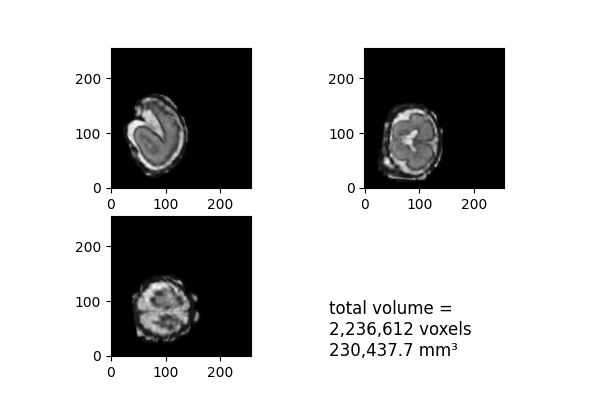

# pl-mri-preview

[](https://hub.docker.com/r/fnndsc/pl-mri-preview)
[](https://github.com/FNNDSC/pl-mri-preview/blob/main/LICENSE)
[](https://github.com/FNNDSC/pl-mri-preview/actions/workflows/ci.yml)

`pl-mri-preview` is a [_ChRIS_](https://chrisproject.org/) plugin
to produce PNG image previews of the center slices of MRIs
(NIFTI, MINC, ...) and also compute total brain volume.



## Installation

`pl-mri-preview` is a _[ChRIS](https://chrisproject.org/) plugin_, meaning it can
run from either within _ChRIS_ or the command-line.

[](https://chrisstore.co/plugin/pl-mri-preview)

## Local Usage

To get started with local command-line usage, use [Apptainer](https://apptainer.org/)
(a.k.a. Singularity) to run `pl-mri-preview` as a container:

```shell
singularity exec docker://fnndsc/pl-mri-preview mri_preview [--background 0.0] input/ output/
```

To print its available options, run:

```shell
singularity exec docker://fnndsc/pl-mri-preview mri_preview --help
```

## Examples

`mri_preview` requires two positional arguments: a directory containing
input MRI images, and a directory where to create output PNGs.

```shell
mkdir incoming/ outgoing/
mv brain_recon.nii.gz incoming/
singularity exec docker://fnndsc/pl-mri-preview mri_preview incoming/ outgoing/
```

## File Types

### `--inputs`

Every input file with a file name ending with a value given by `--inputs`
is processed. Unmatched files are ignored. Supported formats are listed on
[NiBabel](https://nipy.org/nibabel/)'s website.

### `--units-fallback`

`pl-mri-preview` can get voxel size units from the headers of NIFTI or MINC files.
Units can be specified manually for other file types using `--units-fallback`.

https://github.com/nipy/nibabel/pull/1098

### `--outputs`

`pl-mri-preview` creates image files. Supported output formats are
any which are supported by
[matplotlib](https://matplotlib.org/stable/api/_as_gen/matplotlib.pyplot.savefig.html),
including `.png`, `.jpg`, and `.svg`.

The special type `.txt` writes a plaintext file instead, e.g.

```
2236612 voxels
230437.66977741406 mm^3
```

## About Brain Volume

### Input File

The input file should be masked (or it should be a mask), meaning it should have
a background intensity which is lower than the foreground intensity -- usually
the value denoting background is just 0 or 1.

`pl-mri-preview` is part of a pipeline which runs after
[`pl-irtk-reconstruction`](https://github.com/FNNDSC/pl-irtk-reconstruction).

### v.s. `mri_label_volume`

`mri_label_volume -a` is a FreeSurfer tool to do the same thing, though their
non-zero intensity threshold starts at and includes 5, which depending on what
kind of input  file you're working with, is probably an underestimation.

- https://github.com/freesurfer/freesurfer/blob/b11d2d547216a66dedeffc7b277feaf80c265795/mri_label_volume/mri_label_volume.cpp#L106-L113
- https://github.com/freesurfer/freesurfer/blob/8c012da48fc79c99d5b315b169799c78847defa5/include/mri.h#L1138
- https://github.com/freesurfer/freesurfer/blob/e34ae4559d26a971ad42f5739d28e84d38659759/utils/mriset.cpp#L3062-L3082

To reproduce the behavior of `mri_label_volume  -a` with `pl-mri-preview`,
specify the value `mri_preview --background 4.999`.

### From Surfaces

Another computational approach to measure total brain volume is to compute the volume
inside a topologically closed polygonal mesh representation of the pial matter.
This object obtained from a surface extraction algorithm, such as
[ep-sphere_mesh](https://github.com/FNNDSC/ep-sphere_mesh).

The advantage of measuring volume from a surface instead of in voxel space is that
the computation is not discrete.
